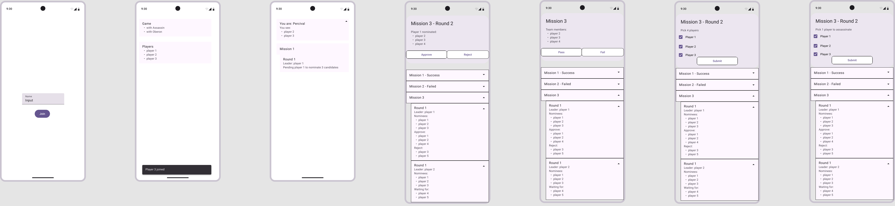

- Background
    - What is the Avalon game?
        - References
        - https://www.ultraboardgames.com/avalon/game-rules.php
        - {{video(https://youtu.be/b5iJjQJkWEQ?t=266)}}
        - Avalon is a werewolf alike board game. It consists 5 - 10 people, divided into 2 teams - good and evil, based
          on the role they are assigned to. The good guys goal is to successfully finish 3 out of 5 missions, while the
          bad guys' goal is to sabotage that.
    - Gameplay
        - Setup Phase
            - Each player is assigned a role
                - Good
                    - Merlin
                    - Percival
                    - Villager (Servants of Merlin)
                - Evil
                    - Mordred
                    - Morgana
                    - Assassin
                    - Oberon
            - Some roles see other players
                - Merlin - all member from evil team other than Mordred
                    - Morgana
                    - Assassin
                    - Oberon
                - Percival
                    - Merlin
                    - Mordred
                - Mordred - all members from evil team other than Oberon
                    - Morgana
                    - Assassin
                - Morgana - all members from evil team other than Oberon
                    - Mordred
                    - Assassin
                - Assassin - all members from evil team other than Oberon
                    - Mordred
                    - Morgana
        - Mission Phase
            - The game consists of 5 missions, the goal is to pass or fail these missions. A designated leader (rotating
              each round) propose a team contains required number of players to go on the mission. The number of players
              required depends on the round and total number of players.
            -
          | Number of Players | 5 | 6 | 7 | 8 | 9 | 10 |
                                                                                                                                                                                |-------------------|---|---|---|---|---|----|
          | Mission 1         | 2 | 2 | 2 | 3 | 3 | 3  |
          | Mission 2         | 3 | 3 | 3 | 4 | 4 | 4  |
          | Mission 3         | 2 | 4 | 3 | 4 | 4 | 4  |
          | Mission 4         | 3 | 3 | 4 | 5 | 5 | 5  |
          | Mission 5         | 3 | 4 | 4 | 5 | 5 | 5  |
            - All players vote (publicly) to approve or reject the proposed team.
                - If the majority of players vote for the proposed team, the game proceeds on game execution
                - If the proposed team does not get a majority vote, then the leader role rotates, the new leader
                  propose a new team
                - If the proposals get rejected 5 times in a row, the evil team wins the mission
            - Mission Execution
                - Selected team members secretly submit either a Success or Fail card.
                - If even one Fail card appears (except Mission 4 requires 2 fail cards), the mission fails.
            - The leader rotates again and the next mission starts.
        - Victory Conditions
            - Good wins: Complete 3 successful missions.
            - Evil wins: Complete 3 failed missions or successfully identify Merlin if the good side wins the missions.
            - Merlin Assassination: If Good achieves 3 missions, Evil gets one last chance to win by guessing who is
              Merlin.
    - Problem statement
        - Must be physically together to play the game
        - People get distracted during the game, i.e. don't know who the nominees are or who is the leader of the round
        - It's hard to remember who voted for whom, giving people with better memories uneven advantage.
        - We need something to help us
            - tracking the game status, receive input from players then broadcast to all players
            - providing realtime status and accessible from the Internet
                - for example the current leader needs to receive notification about nominate X players for Y mission,
                  while all other players know who the current leader is and the game is pending his/her action
            - record and list all leaders, their nominations and players votes
        - Technical design
            - Actors and actions
                - Game admin
                    - Creates game
                    - Set game configuration
                        - If the game is with Assassin
                        - If the game is with Oberon
                        - How many rounds of assassination the evil team gets
                        - The role knowledge of each role
                  >       The reason why the word soft in software is that software itself should be easily changed. This of course is the ultimate goal of all the software projects.
                            I've decided to include this because I noticed different sources give different versions of the role knowledge. Plus, it's always a good habit to make hard-coded assumptions configurable, it only takes a couple lines of code but can make your software much more flexible.
                    - Send out game invitation
                    - Officially start a game
                - Players
                    - Join the game via invitation
                    - Receive role and role knowledge after game started
                    - Receive the latest event of the game
                        - Current mission number
                        - Current round number
                        - Current leader
                        - Previous missions status
                            - nominees
                            - number of passes and fails
                        - Previous round status
                            - leader
                            - nominees
                            - players votes
                        - Pending actions
                            - Who have voted and who have not in a round
                            - Waiting for the round leader to choose nominees
                            - Which nominees have voted for a mission and which have not
                            - Waiting for the assassin to choose a target
                    - Perform actions
                        - Vote for a team proposal
                        - Vote for a mission
                        - Pick nominees for a mission
                        - Pick a target to assassinate
            - Considerations
                - The communication between the player and the system must be realtime and bidirectional
                - The system must be accessible via the Internet
                - In case the client side crashes or losing connection, a player must be able to restore all the data
                  any
                  moment, by re-joining the game or click again on the invite
            - Client side
                - Possible ways of communication
                    - web page (recommended approach)
                        - pros:
                            - cross-platform and device
                            - more control over how and what to present the data
                        - cons
                            - need to consider browser crash and refresh
                            - less smooth interaction comparing to native app
                    - email
                        - pros
                            - easy to implement
                        - cons
                            - delay can be high
                            - no guarantee of delivery
                            - hard to present all the data of a long game in a single email
                    - text message
                        - same pros and cons plus
                        - cons
                            - regulation restrictions, might need verification adding too much complexity to the players
                    - app
                        - pros
                            - better UX
                            - more stable
                        - cons
                            - hard to develop and deploy
                    - IMs app i.e. whatsapp or telegram
                        - pros:
                            - free to interact with, unlike text messages
                        - cons:
                            - text based interaction is restrictive
                - Wireframe
                    - 

            - Backend
                - According to the front-end design, the backend should support the following functionalities
                    - admin creates game
                    - admin starts game
                    - player joins game
                    - broadcast game started
                    - broadcast mission started
                    - broadcast round started
                    - notify each player their role and known players
                    - notify current leader to submit a team proposal
                    - broadcast pending current leader to submit a proposal
                    - team leader submit proposal
                    - broadcast the submitted proposal
                    - broadcast vote for the proposal
                    - players vote for proposal
                    - broadcast any player has voted
                    - broadcast round result
                    - notify team member to vote for a mission
                    - broadcast pending team members to vote for the mission
                    - players vote for mission
                    - broadcast any team member has voted
                    - broadcast mission result
                    - notify assassin to pick a target
                    - broadcast pending assassin picking a target
                    - assassin picks a target
                    - broadcast assassin picked target
                    - broadcast assassination result
                    - broadcast game result
                - 
                - Mermaid source code
                    ```
                    stateDiagram-v2
                        [*] --> GameSetup
                        GameSetup --> InfoReveal
                        InfoReveal --> TeamLeaderAssignment
                        TeamLeaderAssignment --> TeamSelection
                        TeamSelection --> Voting
                        Voting --> QuestPhase
                        Voting --> TeamLeaderAssignment: Team Rejected (Next Leader)
                        QuestPhase --> TeamLeaderAssignment: Quest Completed (Next Leader)
                        QuestPhase --> GameEnd: Quests completed
                        GameEnd --> [*]
                    ```
                - Backend architecture
                    - websocket (proposed solution)
                        - pros
                            - real-time communication
                            - bidirectional communication
                        - cons:
                            - might lose connection
                            - more complicated to implement
                    - REST-ful
                        - pros:
                            - simple
                            - stateless
                            - wide adoption
                        - cons:
                            - does not support bidirectional communication natively, require polling or other
                              alternatives
                    - GraphQL
                        - pros:
                            - flexible queries
                            - single endpoint
                        - cons:
                            - overly complicated for the use case
                    - gRPC
                        - pros
                            - high performance
                            - bidirectional communication
                        - cons
                            - limited support in browsers
                            - overly complicated for the use case
                    - SOAP
                        - pros:
                            - strict standard
                            - built-in error handling
                        - cons:
                            - more complicated than REST
                            - xml format requires more overhead of data transfer
                            - less flexible
                    - JSON-RPC and XML-RPC
                        - not suitable for server to client communication
                - Cloud service
                    - Lambda (recommended)
                        - pros:
                            - pay-per invocation
                                - auto scale
                                - fully managed
                            - cons:
                                - short-lived
                                - no OS access
                                - 15 minutes limit
                    - EC2
                        - pros:
                            - full control over instance
                            - long-running
                        - cons:
                            - having to manage OS
                - DB:
                    - DynamoDB (recommended)
                        - key-value
                        - pros:
                            - pay per request
                    - Others
                        - RDS, Aurora, DocumentDB and etc
                            - relational and no-SQL
                        - cons:
                            - pay per hour
                    -
                - Summary
                    - application will be a cloud hosted, event driven application
                    - backend will be a serverless application, using Lambda, DynamoDB and API gateway
                    - REST-ful endpoint

                      | Http Method | Path                   | Description   |
                                                                                                            |-------------|------------------------|---------------|
                      | POST        | admin/game/            | Create a game |
                      | POST        | admin/game/{game_id}   | Start a game  |
                      | PUT         | admin/game/{game_id}   | Update a game |
                      | POST        | /game/{game_id}/player | Join a game   |
                      |             |                        |
                        - Websocket events

                          | **Event Name**                    | **Description**                                          |
                                                                                                                              |-----------------------------------|----------------------------------------------------------|
                          | player:join_game                  | A player joins the game.                                 |
                          | broadcast:game_started            | Notify all players that the game has started.            |
                          | broadcast:mission_started         | Notify all players that a mission has started.           |
                          | broadcast:round_started           | Notify all players that a new round has started.         |
                          | notify:player_role                | Notify each player of their role and known players.      |
                          | notify:leader_team_proposal       | Notify the current leader to submit a team proposal.     |
                          | broadcast:pending_team_proposal   | Broadcast that the leader needs to submit a proposal.    |
                          | leader:submit_proposal            | Leader submits the team proposal.                        |
                          | broadcast:submitted_proposal      | Broadcast the submitted team proposal.                   |
                          | broadcast:proposal_vote           | Notify players to vote on the proposal.                  |
                          | player:vote_proposal              | A player votes on the proposal.                          |
                          | broadcast:player_voted            | Broadcast when any player has voted.                     |
                          | broadcast:round_result            | Broadcast the result of the round.                       |
                          | notify:team_vote_mission          | Notify selected team members to vote on the mission.     |
                          | broadcast:pending_mission_vote    | Broadcast that team members need to vote on the mission. |
                          | player:vote_mission               | A team member votes on the mission.                      |
                          | broadcast:team_member_voted       | Broadcast when any team member has voted.                |
                          | broadcast:mission_result          | Broadcast the mission result.                            |
                          | notify:assassin_pick_target       | Notify the assassin to pick a target.                    |
                          | broadcast:pending_assassin_target | Broadcast that the assassin is selecting a target.       |
                          | assassin:pick_target              | Assassin picks a target.                                 |
                          | broadcast:assassin_picked         | Broadcast that the assassin has chosen a target.         |
                          | broadcast:assassination_result    | Broadcast the result of the assassination.               |
                          | broadcast:game_result             | Broadcast the final result of the game.                  |
                          |                                   |                                                          |
                    - Data models
                        - Game

                              ```
                              {
                                  "game_id": {uuid},
                                  "sk_id": {game},
                                  "status": str /* not_started, started, ended */
                                  "result": bool
                              }
                              ```
                        - Player

                            ```
                            {
                                "game_id": {uuid},
                                "sk_id": player_{player_id},
                                "name": {name},
                                "secret": {uuid} /* to have some level of security */
                                "role": str,
                                "known_players": [{player_id}, ...]
                            }
                            ```
                        - Mission

                            ```
                            {
                                "game_id": {uuid},
                                "sk_id": mission_{mission_number},
                                "mission_number": 1,
                                "votes": {{player_id}: bool}
                            }
                            ```
                        - Mission vote

                            ```
                            {
                                "game_id": {uuid},
                                "sk_id": mv_mission_{mission_number},
                                "mission_number": 1,
                                "player_id": {player_id},
                                "vote": bool
                            }
                            ```
                        - Round

                            ```
                            {
                                "game_id": {uuid},
                                "sk_id": round_{mission_number}_{round_number},
                                "mission_number": 1,
                                "round_number": 2,
                                "leader": {player_id},
                                "proposal": [{player_id}, ...],
                            }
                            ```
                        - Round vote

                            ```
                            {
                                "game_id": {uuid},
                                "sk_id": rv_{mission_number}_{round_number},
                                "player_id": {player_id},
                                "vote": bool
                            }
                            ```
                        - Assassination vote

                            ```
                            {
                                "game_id": {uuid},
                                "sk_id": "assassination_{attempt}",
                                "target_id": {player_id}
                            }
                            ```
                        - Event

                            ```
                            {
                                "game_id": {uuid},
                                "sk_id": "event_{timestamp}",
                                "recipient": [{player_id}, ...],
                                "payload": str
                           }
                           ```

    